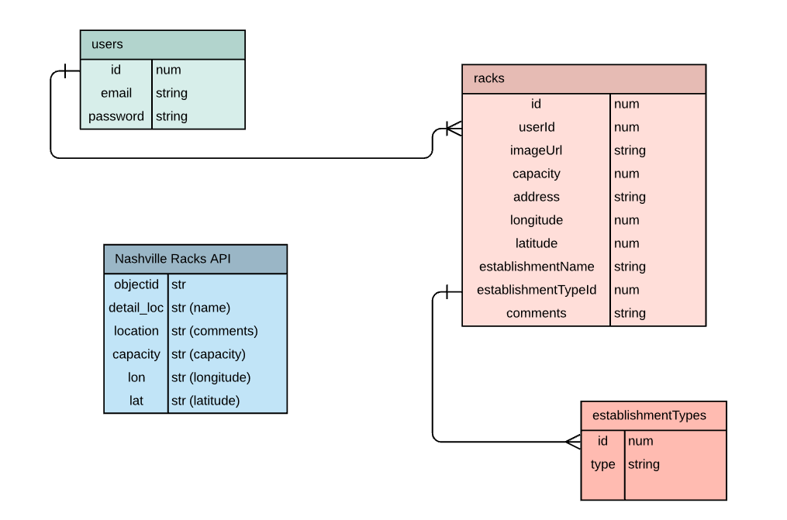

# Bike Stash: NSS Front End Capstone
This application that shows on a map where bike racks are located in Nashville. Data is crowd-sourced by users and stored in JSON. The user can log in and add, edit, and delete bike racks they have seen around town. A map on the home page shows the user where  ALL the added racks are, not just theirs. 

## Why I Made This
I love to ride my bike around Nashville. I wanted to make it easier on myself and my fellow bike lovers to get around town, as well as make Nashville a little bit more bike friendly. It would be nice to see if wherever I'm going has a bike rack, or if I'm going to have to ride around for a minute and lock my bike to a random parking meter/skinny tree/wrought iron fence.

## Demo

## MVP
-Create account/account login  
-Map which renders all rack locations as pins  
-Can click on pins to display a popup with details  
-Nav bar with "Home", “My Racks”, “Logout”, “Add a Rack”  
-“My Racks”--gets all racks from JSON that the user has added (with edit and delete capabilities)  
-“Add a Rack”--renders form for user to add rack  

## Tools Used
React, JSON, Leaflet, Mapbox, Cloudinary, LocationIQ, Material-UI, Nashville.gov external API
This project was bootstrapped with [Create React App](https://github.com/facebook/create-react-app).

## To See This Application:

1. Clone down the repo: `git@github.com:erinepolley/Front-End-Capstone.git`
2. Run `npm install` for dependencies.
3. In the api directory, run `json-server -p 5002 racks.json`.
3. Run `npm start` in the root directory.

